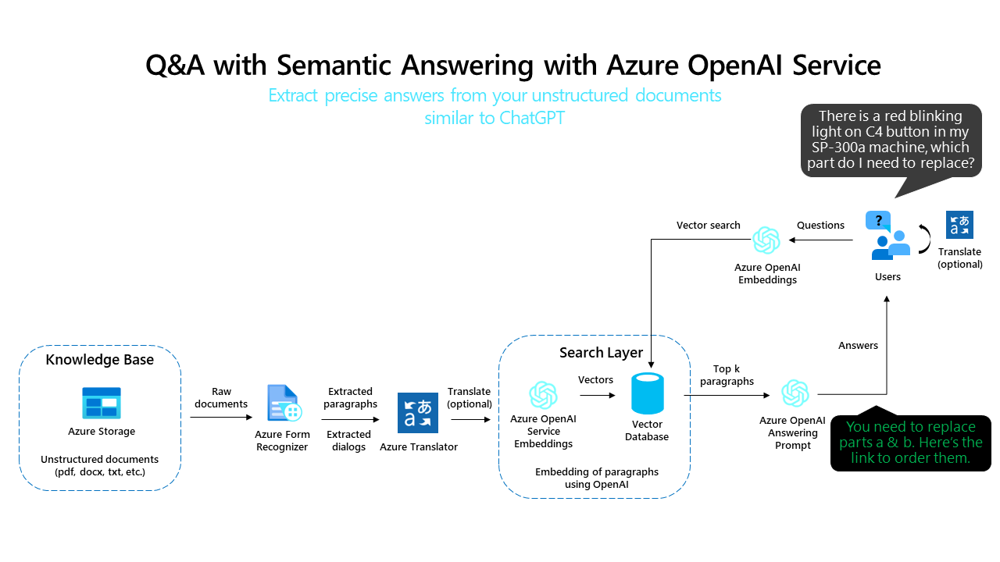

# Redis Vector Search Demo

For details about using this service, see [details.md](details.md)




## Building and Publishing

**Note:** Connect to Redis server with VPN then:

1. Clone this repo with:

```bash
git clone https://github.com/iportilla/search-redis.git
```

2. Copy .env.sample to .env with:

```bash
cp .env.sample .env
```

3. Update .env with *Azure OpenAI* settings:

```bash
INDEX_NAME=	"INDEX_NAME"
REDIS_HOST="LOCALHOST"
REDIS_PORT=6379
API_KEY="YOUR_API_KEY"
API_BASE="YOUR_API_BASE_URL"
API_TYPE=azure
API_VERSION=2023-05-15
EMBEDDING_MODEL=text-embedding-ada-002
```

4. Run

```bash
make clean
make build
make run
```
